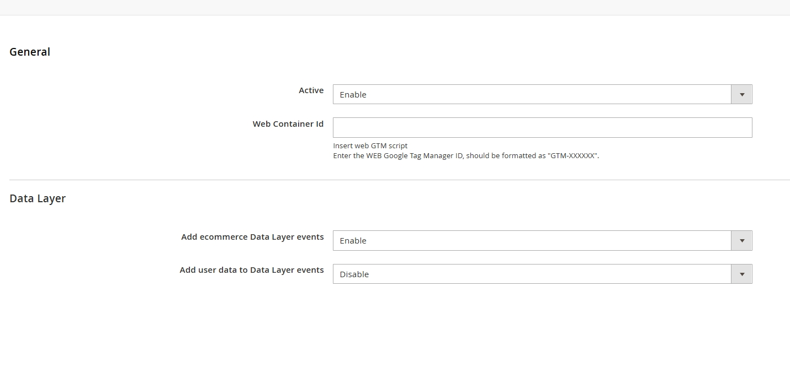

# Magento2 google tag manager module
Magento2 google tag manager module, A simple, clear and fully functional GA module. Compatible with breeze theme.

## The list of e-commerce events:
- Collection view
- View Item
- Add to cart
- Begin checkout
- Add payment info
- Purchase

## User data:

- Email
- First name
- Last name
- Customer ID



## composer install
```
composer require dmtq/magento-2-google-tag-manager
php bin/magento setup:upgrade
php bin/magento setup:static-content:deploy
```
